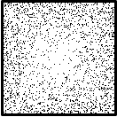

SLO implements a collection of routines for constructing and evaluating hig-performance linear operators on multicore and accelerator platforms.

## Installation
1. Install Anaconda or Miniconda.
2. Download `slo`.
```
git clone git@github.com:mbdriscoll/slo.git
cd slo
```
3. Create a `conda` environment and install `slo`'s dependences.
```
conda env create --file requirements.txt
```
4. (Optional) Run the test suite.
```
pytest
```

## Examples
See [spmm.py](https://github.com/mbdriscoll/slo/blob/master/examples/spmm.py) in the `examples` directory.

## Available Backends

SLO provides three backends. Users need not change any application code to move between them.
* Numpy: reference backend. Slow, but widely available and provides informative error messages.
* MKL: multicore CPU backend utilizing Intel's FFT and Sparse Blas libraries.
* CUDA: GPU backend utilizing nVidia's CUFFT and CUSPARSE libraries.

To select a backend, import and instantiate it:
```python
from slo.backends.cuda import CudaBackend
b = CudaBackend(device_id=1)
```

## Available Operators
SLO provides a number of classes for constructing structured linear operators.

### Simple Operators
Simple operators implement linear transformations directly via high-performance libraries.

#### Diagonal Matrix (`slo.operators.Diag`)


#### Sparse Matrix (`slo.operators.SpMatrix`)


#### Dense Matrix (`slo.operators.DenseMatrix`)


#### DFT Matrix (`slo.operators.UnscaledFFT`)

Supports 3D FFTs. 1D and 2D TBD.


### Composite Operators

Composite operators represent a collection of operators arranged in some structured way.


#### BlockDiag Matrix (`slo.operators.BlockDiag`)


Represents different submatrices arranged along a diagonal.

#### KronI Matrix (`slo.operators.KronI`)


The `KronI` operator represents repetition of the same submatrix along a diagonal.


#### VStack Matrix (`slo.operators.VStack`)


Represents different submatrices stacked vertically. Akin to `scipy.sparse.vstack`.

#### HStack Matrix (`slo.operators.HStack`)

Currently unimplemented. Consider using `VStack` and `Adjoint`:
```
HStack(A,B) = Adjoint( VStack( Adjoint(A), Adjoint(B) ) )
```

#### Product Matrix (`slo.operators.Product`)


#### Adjoint Matrix (`slo.operators.Adjoint`)


### Derived Operators
We can combine the aforementioned operators to implement higher-level functionality.

#### Unitary DFT matrix (`slo.operators.UnitaryFFT`)


The scaling effect of the DFT can be undone by an elementwise multiplication, represented in SLO as a diagonal matrix.

#### Centered DFT matrix (`slo.operators.CenteredFFT`)


A centered DFT consists of an FFT Shift, followed by a standard FFT, followed by another FFT Shift.


#### Non-uniform Fourier Transform (`slo.operators.NUFFT`)


SLO implements an NUFFT as a product of diagonal, FFT, and general sparse matrices (for apodization, FFT, and interpolation, respectively).

## FAQ
1. *What datatypes are supported?* `slo` only support single-precision complex floating point numbers at the moment, but it's not a fundamental limitation.
